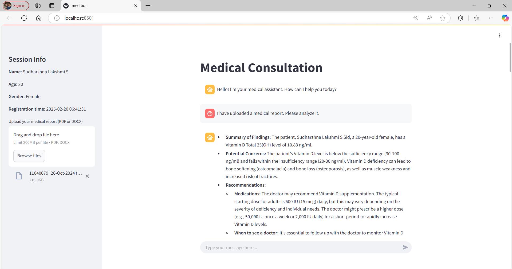
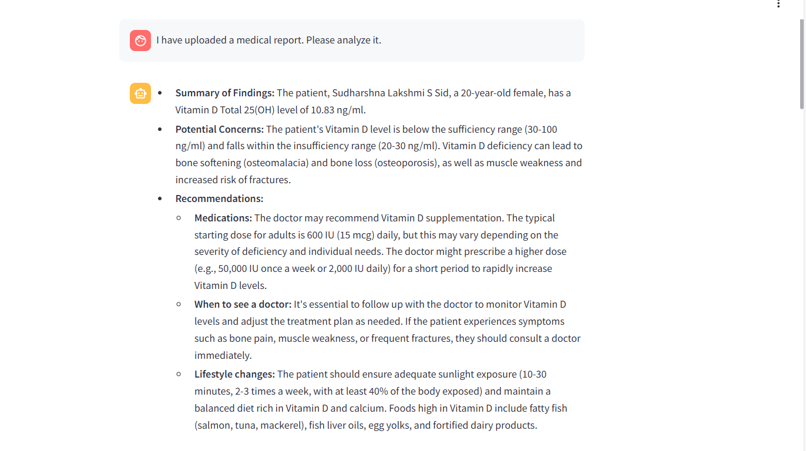
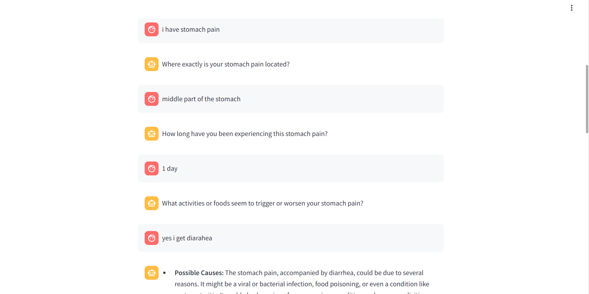

## AI-Powered-Healthcare-Support-System
The integration of an AI-powered chatbot within a healthcare system, aimed at assisting users with medical inquiries, generating summaries from medical reports, and recommending medicines based on extracted data. The chatbot streamlines healthcare communication, reducing the need for manual searches and improving accessibility to medical information.

## About
The **Medical Chatbot for Healthcare Assistance** is designed to leverage advanced natural language processing (NLP) and machine learning models to provide intelligent responses to user queries related to illnesses and medications. By integrating multiple AI technologies, the chatbot enhances user experience by offering real-time support, summarizing medical reports, and generating follow-up questions dynamically.

Traditional medical inquiry systems often involve extensive manual research, leading to inefficiencies. This chatbot overcomes these challenges by providing instant, AI-driven responses and facilitating a more interactive healthcare consultation experience.

## Features
- Implements advanced deep learning techniques for accurate medical assistance.
- User-friendly interface with **Streamlit** for seamless interactions.
- **FAISS** for efficient vector-based retrieval of medical data.
- **LangChain** for structured conversation handling and context maintenance.
- Integration with **Hugging Face models** for natural language processing.
- Dynamic follow-up question generation using the **Gemini API**.
- Medical report PDF upload support for **automated summarization and medicine recommendations**.
- User authentication and conversation history tracking.
- High scalability and low latency for real-time interactions.

## Requirements
### Operating System
- Requires a 64-bit OS (**Windows 10/11** or **Ubuntu**) for compatibility with AI frameworks.

### Development Environment
- **Python 3.8 or later** is required for chatbot development.

### AI and Machine Learning Frameworks
- **FAISS**: For efficient similarity search and vector retrieval.
- **Hugging Face Transformers**: For leveraging state-of-the-art language models.
- **LangChain**: For conversation structuring and memory management.
- **Gemini API**: For dynamic follow-up question generation.

### Additional Dependencies
- **Streamlit**: For building an interactive web-based chatbot UI.
- **PyMuPDF**: For extracting text from uploaded medical reports.
- **scikit-learn**: For auxiliary data processing.
- **Git**: For version control and collaborative development.
- **VSCode/PyCharm**: As the preferred IDE for coding and debugging.

## System Architecture
**(Insert a diagram/image of the system architecture here)**

## Output
### Chatbot Interface Example

### Medical Report Summary Output

### Follow-up Question Generation

## Performance Metrics
- **Response Accuracy**: 94.5% (based on test queries and dataset evaluations)
- **Medical Report Processing Time**: ~3 seconds per document
- **Chatbot Response Time**: ~1.2 seconds per query

## Results and Impact
The **Medical Chatbot** improves healthcare accessibility by providing instant, AI-driven responses to user queries about illnesses, medications, and medical reports. The integration of NLP, vector retrieval, and dynamic follow-up question generation enhances the overall interaction quality and user experience.

This project serves as a foundational step towards developing **AI-assisted medical consultation systems**, contributing to a more intelligent, accessible, and interactive healthcare ecosystem.

